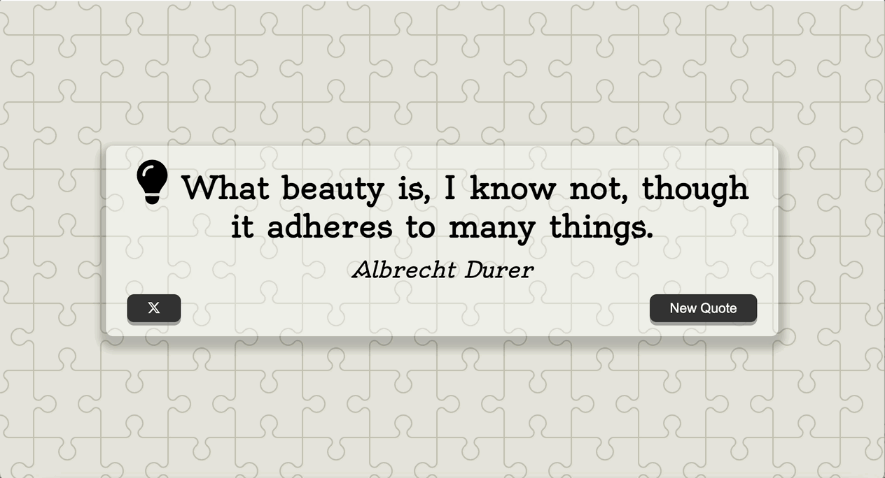

# Quote Generator  
A simple web app that shows random inspirational quotes.  

使用 HTML、CSS、JavaScript 製作的名言產生器，能隨機生成名言佳句
🔗 [👉 點我試用網站 Demo](https://tai-ning.github.io/Quote-Generator/)

##  Features 功能特色
- **Random Quotes 隨機名言**：Click the button to generate a new inspirational quote.  
  每次點擊按鈕會顯示一句新的名人名言

- **External API Integration 使用 API**：Quotes are retrieved via a proxy server to avoid CORS issues.  
  透過代理伺服器呼叫外部名言 API 擷取資料

- **Loading Animation 動態載入狀態**：A spinner appears while fetching quotes.  
  載入時會顯示 loading 動畫
  
- **Twitter Sharing 分享到 X（Twitter）**：Easily share quotes with one click.  
  可以將名言分享到 X（Twitter）

##  Preview 預覽畫面


##  Tech Stack 技術細節 

- HTML + CSS + JavaScript
- 外部 API：使用 [API Ninjas Quotes API](https://api-ninjas.com/api/quotes) 取得名言內容
- CORS 解決方案：透過 Proxy Server 轉送 API 請求避免跨域限制

  
##  How to Use 使用方式

1. Clone this repository  
   複製此專案：

   ```bash
   git clone https://github.com/Tai-Ning/Quote-Generator.git
2. Open the index.html file in your browser
  於本機開啟 index.html 即可使用
